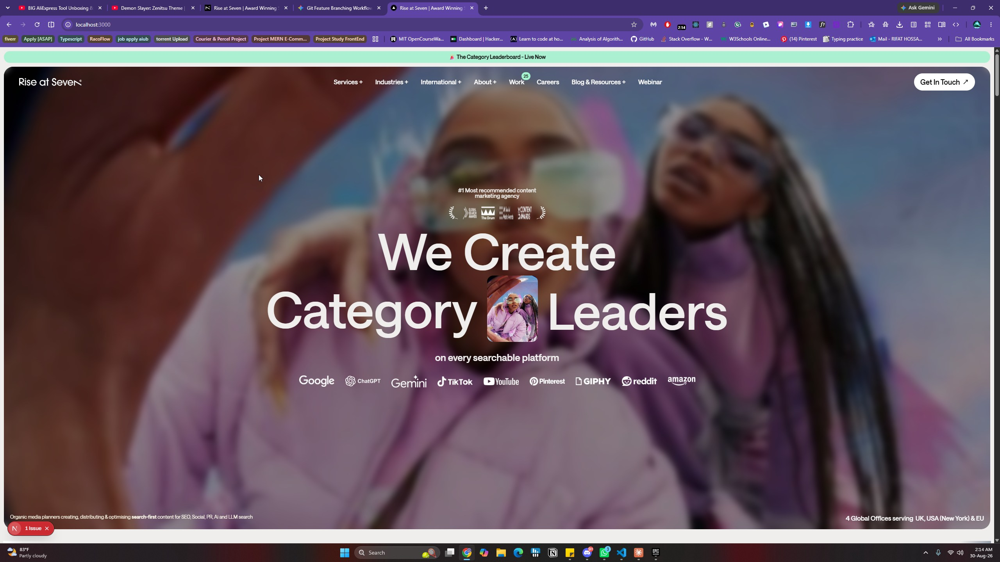
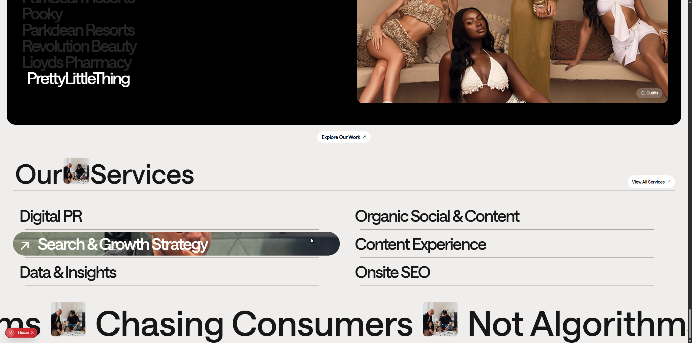
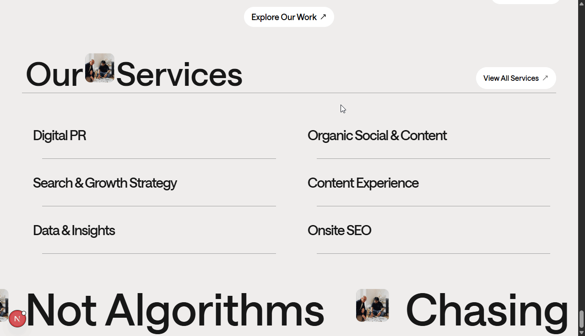
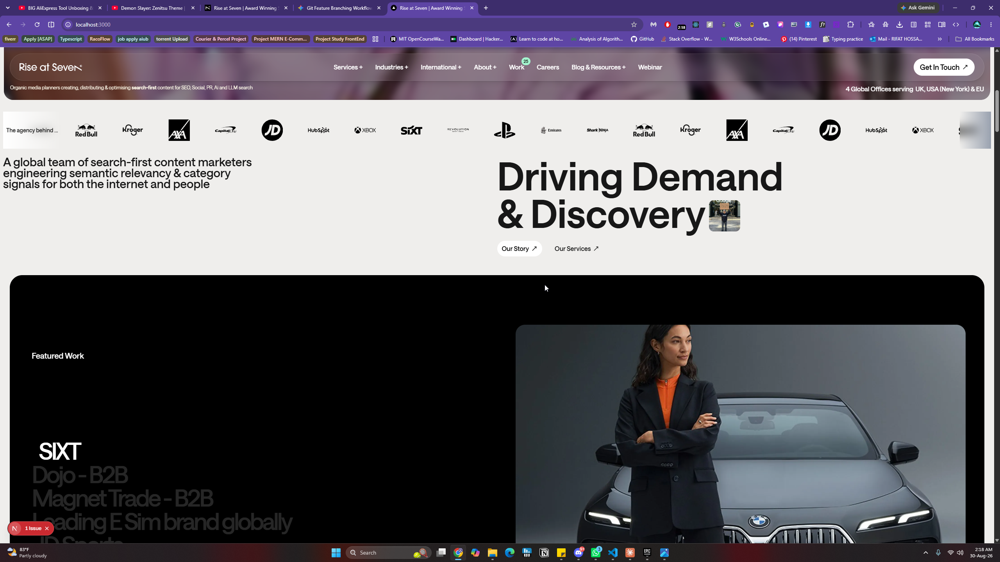
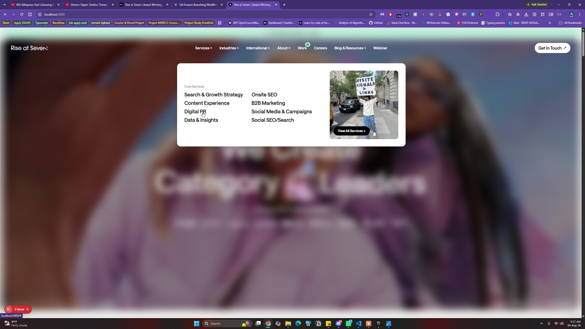
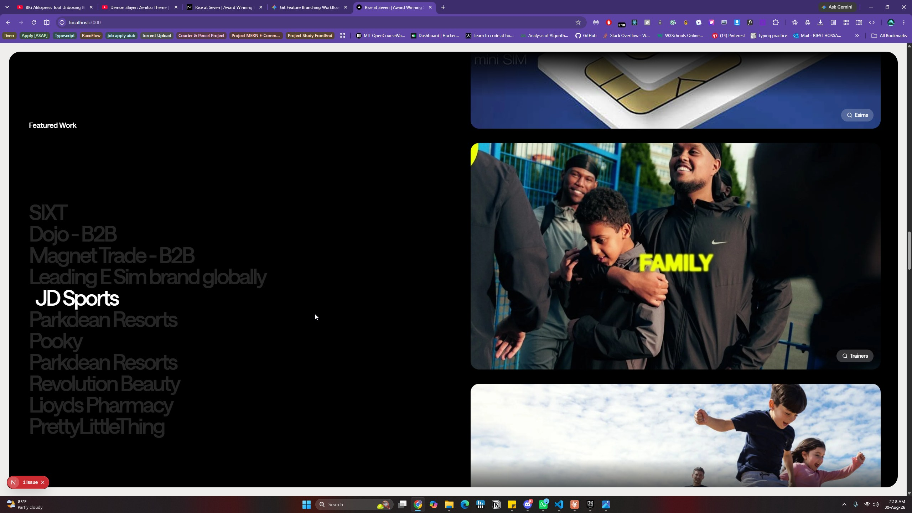

# 🌅 Rise at Seven — Landing Page

A single-page marketing / landing site for **[Rise at Seven](https://www.riseatseven.com)** — the award-winning, search-first content marketing agency. Built with **Next.js 16 (App Router)**, **React 19**, **Tailwind CSS v4**, and rich **GSAP** animations.

🔗 **Live Demo:** [https://rise-at-seven-homepage-livid.vercel.app/](https://rise-at-seven-homepage-livid.vercel.app/)

## 📸 Screenshots



| Our Services | Services (animated) | Icon Marquee |
|:---:|:---:|:---:|
|  |  |  |
| **Floating Navigation** | **Sticky Timeline** | |
|  |  | |

---

## 📖 About The Project

This project recreates the Rise at Seven homepage as a modern, animated single-page site. The page is composed of the following sections (top to bottom):

| # | Section | Component |
|---|---------|-----------|
| 1 | Announcement banner ("Category Leaderboard — Live Now") | `Button` |
| 2 | Header with mega-menu dropdown navigation | `Header` |
| 3 | Hero | `Hero` |
| 4 | Infinite scrolling icon marquee | `IconMarquee` |
| 5 | About | `About` |
| 6 | Featured work showcase (scroll-driven) | `FeaturedWork` |
| 7 | Our services | `OurServices` |
| 8 | Text carousel ("not algorithm") | `TextCaurasalNotAlgorithm` |
| 9 | Footer | `Footer` |

## ✨ Features

- 🎞 **GSAP animations** — scroll-driven `FeaturedWork` showcase and a custom animated `Button`
- ♾ **Infinite marquee** — seamless looping client-icon strip
- 🧭 **Mega-menu navigation** — dropdowns for Services, Industries, International, About, and Blog & Resources
- 🔤 **Optimized fonts** — `next/font` with Google Geist + locally hosted **Saans** (weights 300–700) in `app/layout.js`
- ⚡ **React Compiler** — enabled via `babel-plugin-react-compiler`
- 🪝 **Git hooks** — Husky + Commitlint (conventional commits) + lint-staged (ESLint on staged files only)

## 🛠 Built With

| Technology | Purpose |
|------------|---------|
| [Next.js 16](https://nextjs.org) (App Router) | React framework |
| [React 19](https://react.dev) | UI library |
| [Tailwind CSS v4](https://tailwindcss.com) | Styling |
| [GSAP 3](https://gsap.com) + `@gsap/react` | Scroll & element animations |
| [Motion](https://motion.dev) | Component animations (installed; currently only used by test components, not on the homepage) |
| `lucide-react`, `react-icons` | Icons |

## 🚀 Getting Started

### Prerequisites

- **Node.js** 18.18 or later (20+ recommended)
- **npm** 9 or later

### Installation & Run

```bash
# 1. Clone the repository
git clone https://github.com/rifat328/rise-at-seven-homepage.git
cd rise-at-seven-homepage

# 2. Install dependencies
npm install

# 3. Start the development server
npm run dev
```

Open **[http://localhost:3000](http://localhost:3000)** in your browser. The page auto-updates as you edit files.

## 📜 Available Scripts

| Script | Command | Description |
|--------|---------|-------------|
| Dev | `npm run dev` | Start the development server |
| Build | `npm run build` | Create an optimized production build |
| Start | `npm run start` | Serve the production build |
| Lint | `npm run lint` | Run ESLint across the project |

## 📁 Project Structure

```
rise-at-seven-homepage/
├── app/                  # Next.js App Router
│   ├── layout.js         # Root layout, fonts, metadata
│   ├── page.js           # Homepage (composes all sections)
│   └── globals.css       # Global styles (Tailwind)
├── components/           # UI components (one per section/feature)
│   ├── Header.js         # Mega-menu navigation
│   ├── Hero.js           # Hero section
│   ├── FeaturedWork.js   # GSAP scroll-driven work showcase
│   └── ...
├── utils/
│   └── navItems.js       # Static data: nav menus, projects, services
├── public/
│   ├── fonts/            # Local Saans font files (woff2)
│   └── image/            # Site imagery
├── .husky/               # Git hooks (pre-commit, commit-msg)
├── eslint.config.mjs     # ESLint (flat config)
└── commitlint.config.mjs # Commit message linting rules
```

## 🎨 Styling & Fonts

- **Tailwind CSS v4** is wired through `@tailwindcss/postcss` — no `tailwind.config.js` needed.
- The primary typeface **Saans** is self-hosted in `public/fonts/` and loaded via `next/font/local` (variable `--font-saans`, used as `font-saans`).

## 🔄 Git Workflow & Commit Convention

This repo enforces code quality and commit standards with **Husky** hooks:

| Hook | What it does |
|------|--------------|
| `pre-commit` | Runs **lint-staged** — auto-fixes ESLint issues on staged `.js`/`.jsx` files; blocks the commit on unfixable errors |
| `commit-msg` | Runs **Commitlint** — enforces conventional commit messages |

### ✍️ Commit Message Format

```
<type>(<Scope>): <short summary in present tense>
```

**Examples:**

```bash
feat(Auth): authentication implemented
fix(Lint): ignore nested build output in ESLint
refactor(Codebase): move files to repo root
chore(Deps): update Next.js to 16.2.4
```

**Allowed types:** `feat`, `fix`, `refactor`, `chore`, `docs`, `style`, `test`, `perf`, `ci`, `build`, `revert`

## 📦 Deployment

This project is already deployed on Vercel — view it live at:
**[https://rise-at-seven-homepage-livid.vercel.app/](https://rise-at-seven-homepage-livid.vercel.app/)**

To deploy your own instance:

```bash
npm run build   # verify the production build locally first
```

Then connect the repository to Vercel, or use any host that supports Node.js.

## 🤝 Contributing

1. Create a feature branch from `main`
2. Make your changes (the pre-commit hook will lint staged files automatically)
3. Commit using the convention above
4. Open a Pull Request

## 📄 License

This project is private and proprietary. All rights reserved by the repository owner.

---
<p align="center">Built with ❤️ using Next.js</p>

